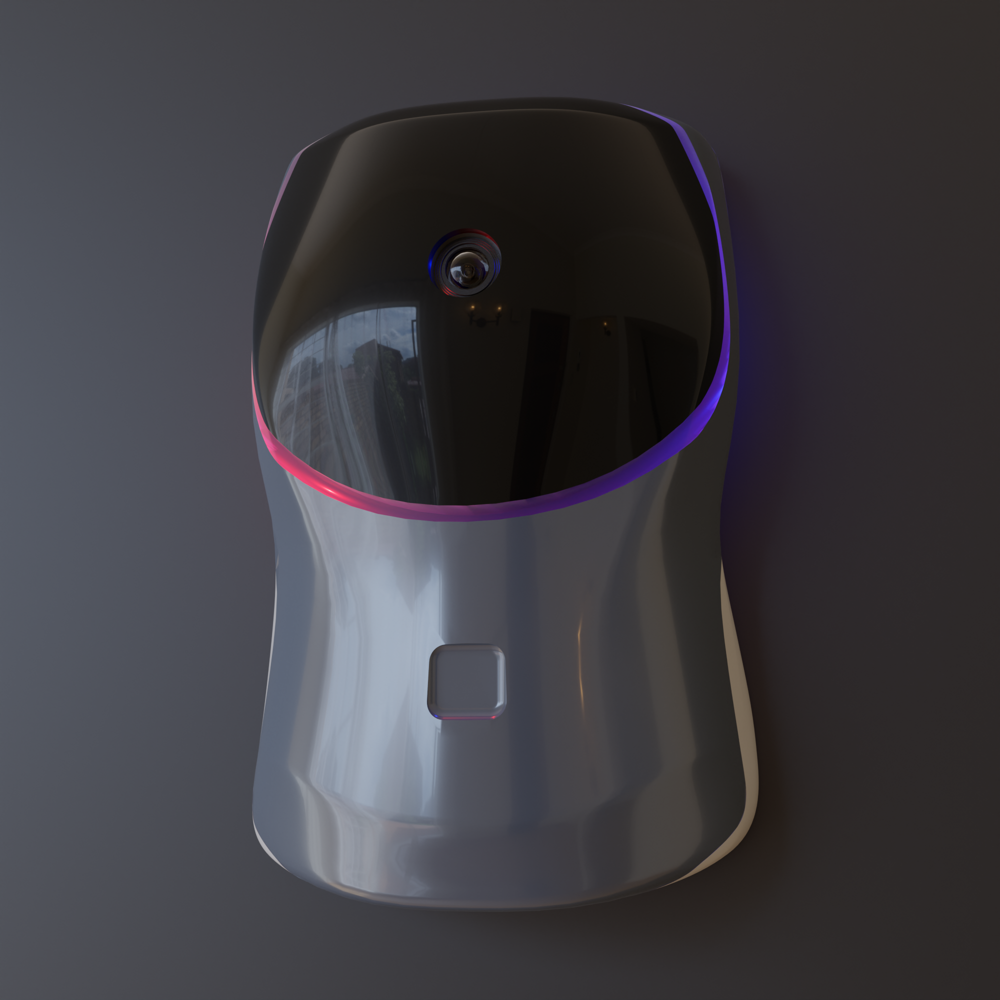
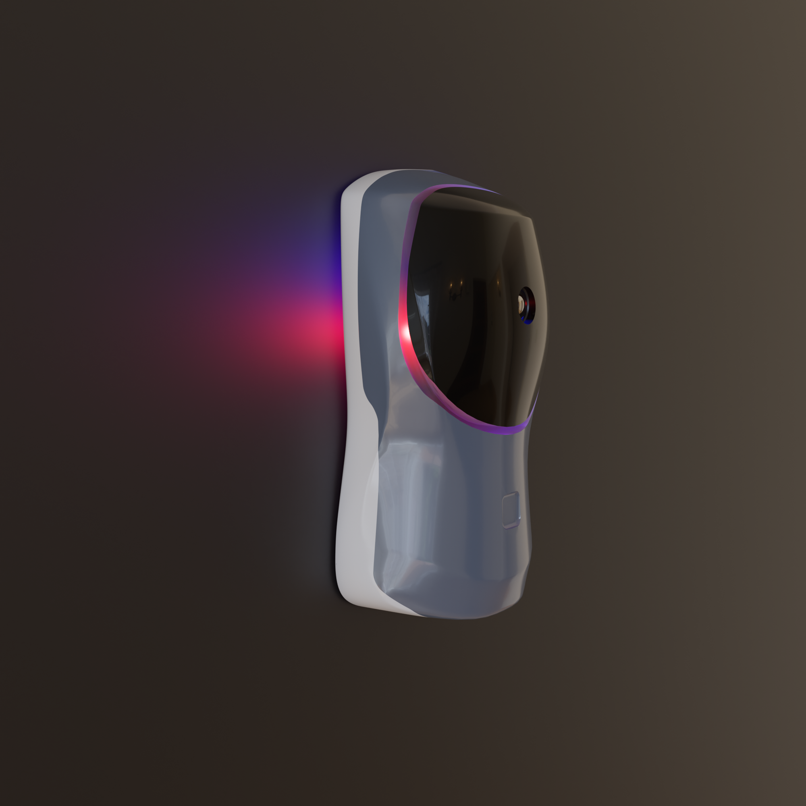
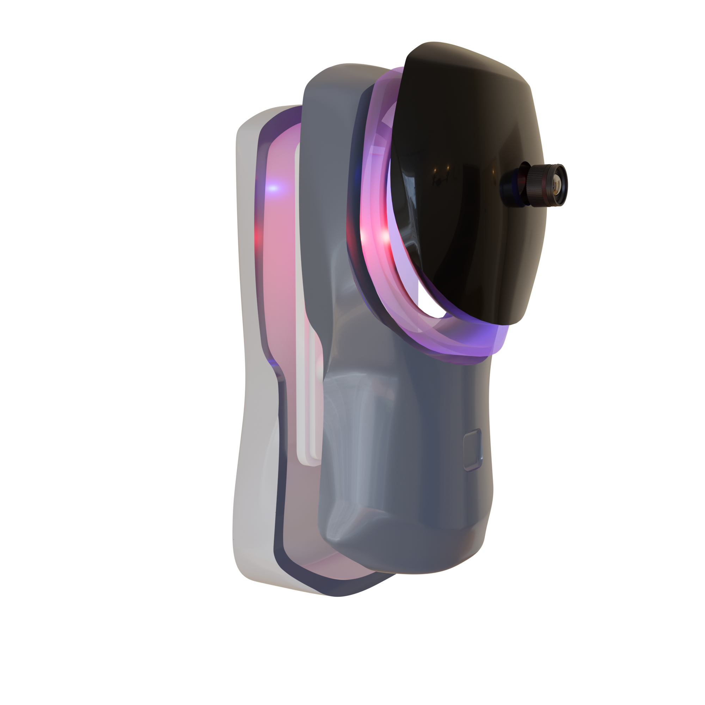
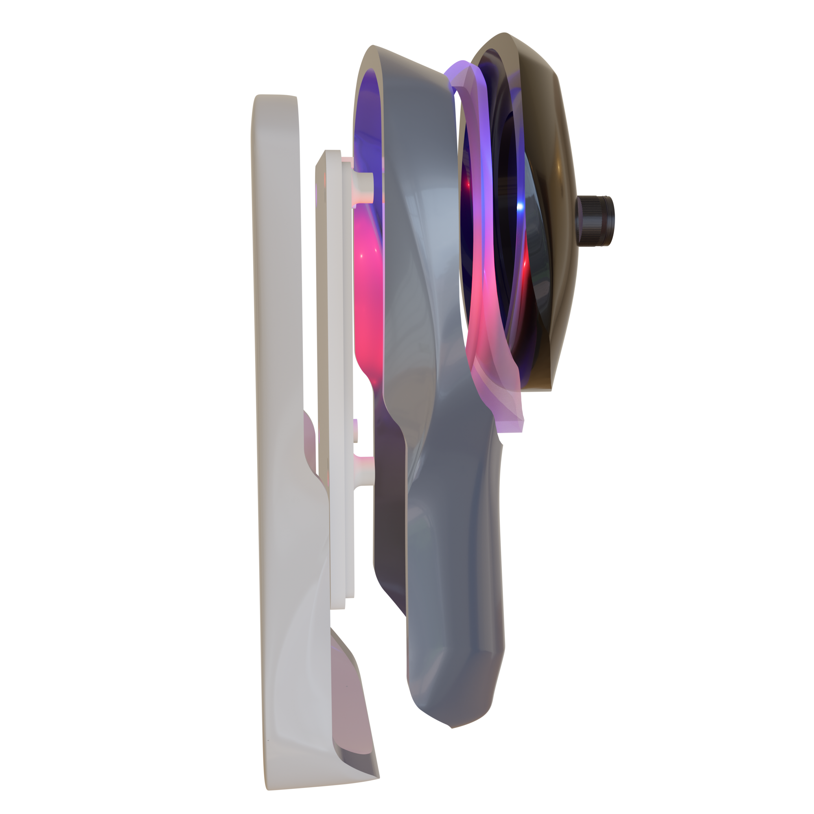

# Project Semester 5
For this module, I would like to create a project that resembles a finished product available on the market. Ever since I got started with 3d printing over the summer, my CAD skills have improved greatly. I am excited to combine my design skills with various technologies and programming methodologies I have acquired throughout my course.

In the previous semester, I created a crude home security system consisting of a single ESP32 camera, a raspberry pi with a camera running MotionEyeOS. These IP cameras were connected to a central server that I crudely constructed from an old HP laptop.

My previous system had several shortcomings:
* The video stream was extremely laggy as a result of no video compression mechanisms and limited upload bandwidth from my home ISP.
*	There were many moving parts which made it very cumbersome to set up
*	No video persistence functionality allowing the user to look back in time – the webpage only displayed a live feed.
*	No audio recording capability.
*	No enclosure for ESP32 camera -the electronics were exposed to the elements.
*	Limited person detection AI functionality -had to run as separate process in remote desktop, used very long terminal command to activate.

In this semester I would like to address these shortcomings in order to create an ecosystem of home security products similar to brands like Ring, or Ubiquiti.

I would like to utilize machine learning to count people passing the front entrance of a home. Perhaps I could create a mobile app using React Native rather than a webpage in order to display video feed and various controls.

## Update 1 -  1st iteration of doorbell camera enclosure

I spent some time in Blender working on the enclosure for the doorbell camera. I wanted to create a simple design that would be easy to print and assemble. I also wanted to make sure that the camera would be protected from the elements.

At first I thought that the ESP32 cam would be suitable for the doorbell camera, however after some consideration, I realized the the limited microprocessor of the ESP32 would not be able to handle juggling between capturing video, listening and transmitting microphone data, and handling incoming audio from the client side all at once. I decided to use a Raspberry Pi 4 with an OV5640 pi camera with night vision. This camera is capable of capturing 1080p video at 30fps.

I bought some inexpensive microphone modules from AliExpress and I will be using one of those for the audio capture. For audio playback, I have many laptop speakers lying around, so I will be using one of those.

Here are some renders of the enclosure:

Here is an exploded view for more context on how the enclosure will be assembled:

