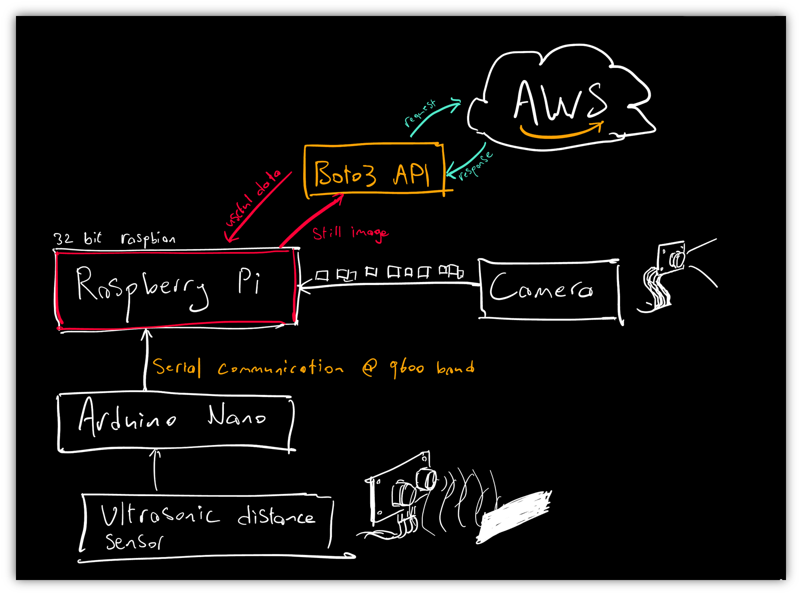

# Project -Semester 5

The aim of this project is to provide users with a smarter solution to the already existing selection of smart doorbell devices that are readily available on the market.
The selling point of my device will be a more automated interaction system which leverages several machine learning algorithms to detect individuals.

The following diagram outlines the basic architecture of the system:

At the core of the system is a Raspberry Pi which runs a python script that is responsible for handling image capture from the raspberry pi camera module and sending it to AWS Rekognition for analysis. An Arduino Nano is connected to the Raspberry Pi via serial and is responsible for the motion detection and led light animation. The Arduino is also responsible for sending a signal to the Raspberry Pi to take a picture when motion is detected.

