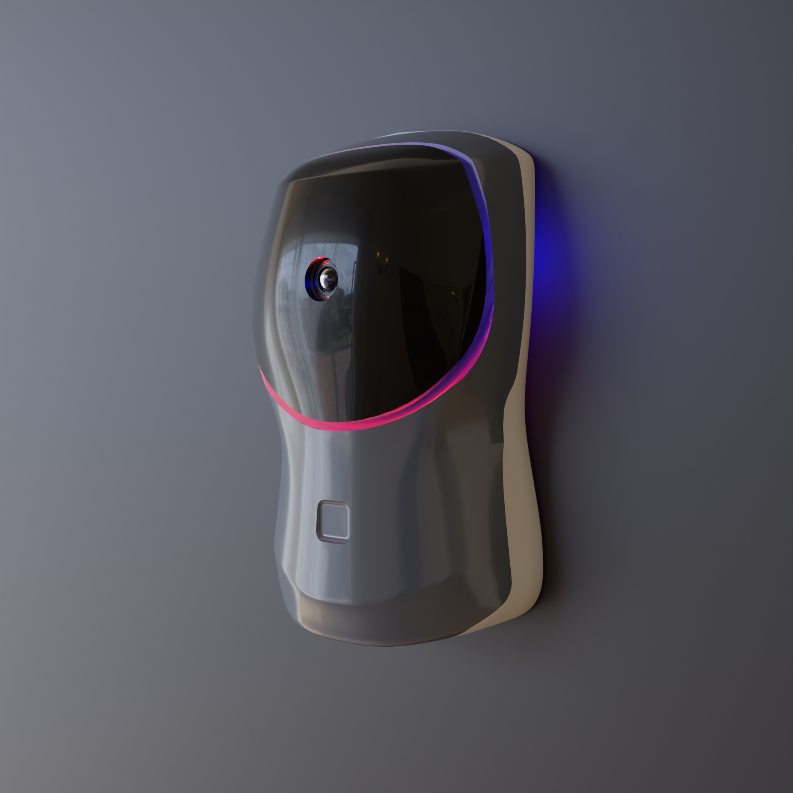
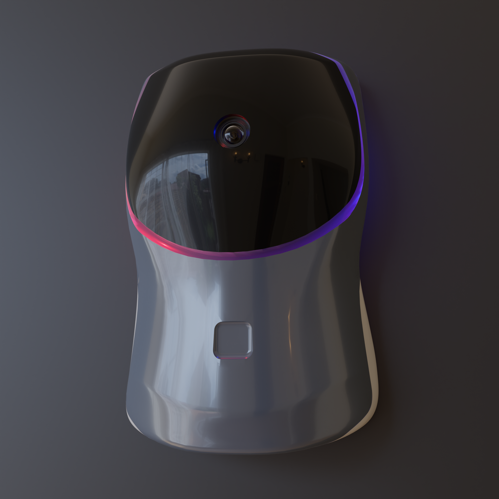
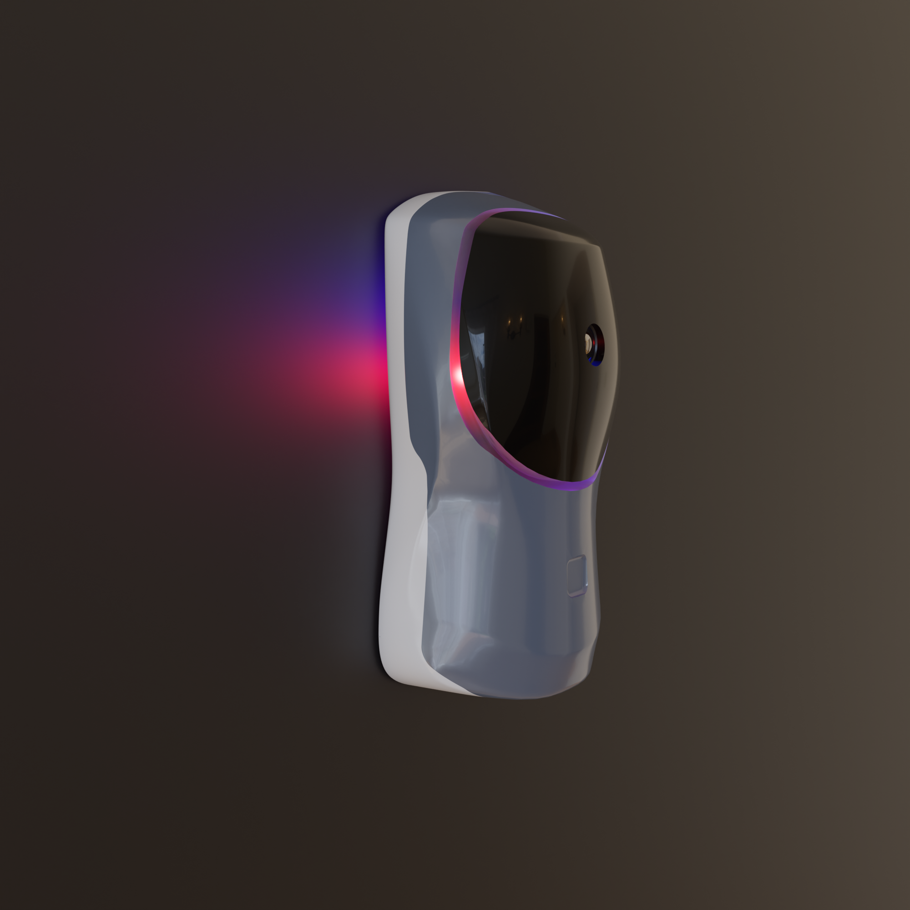
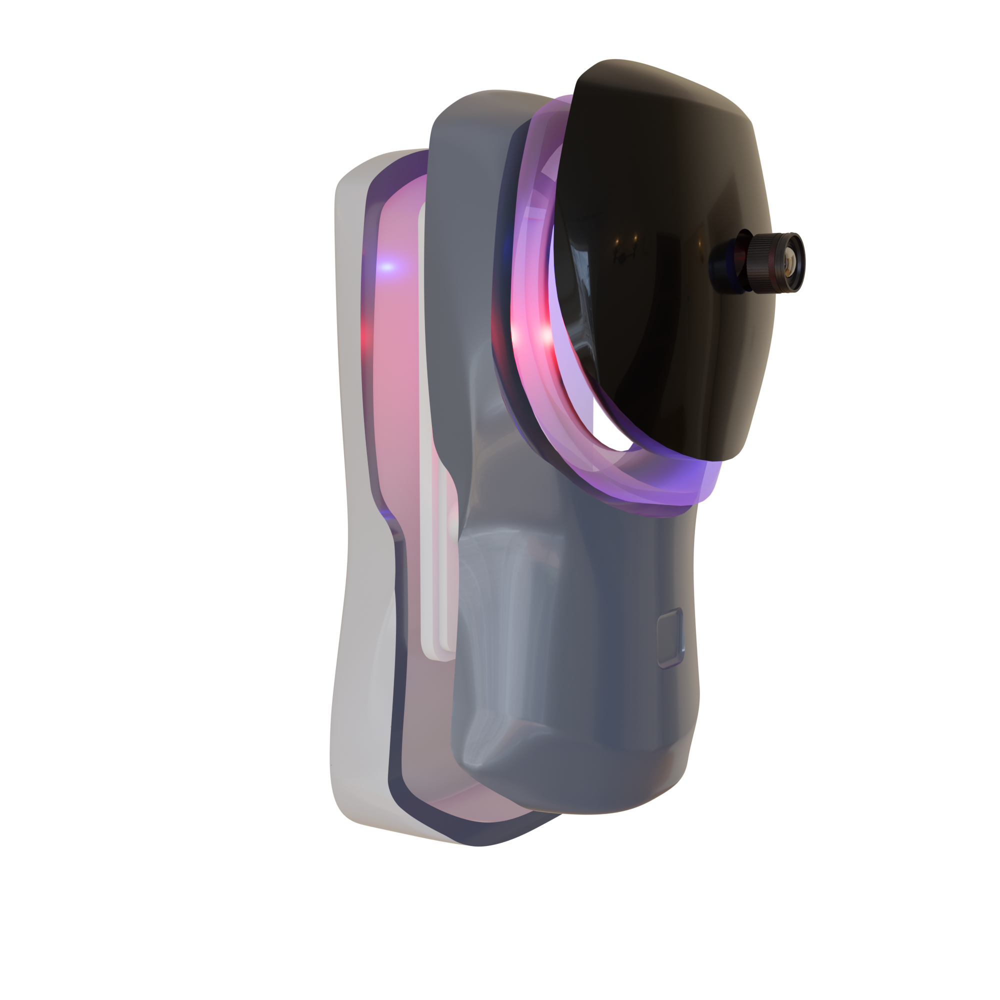
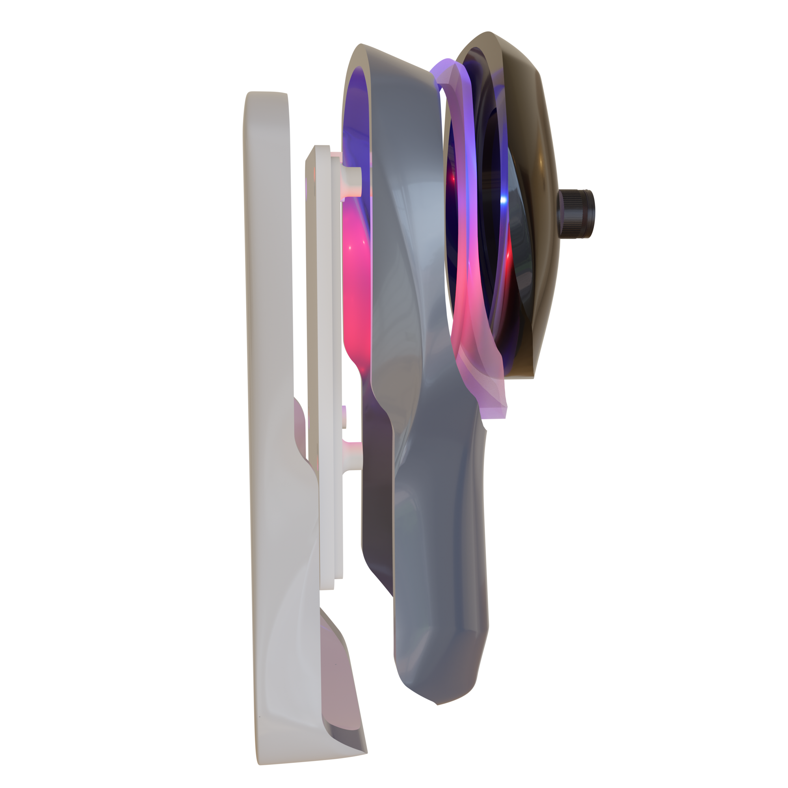
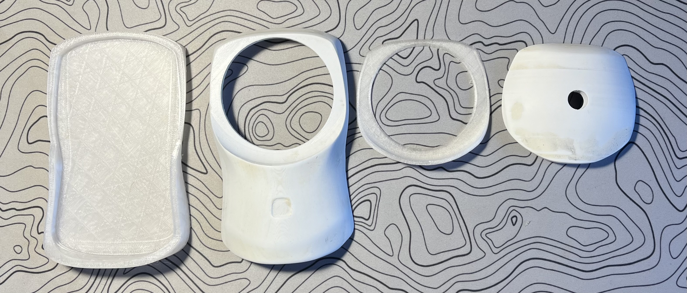
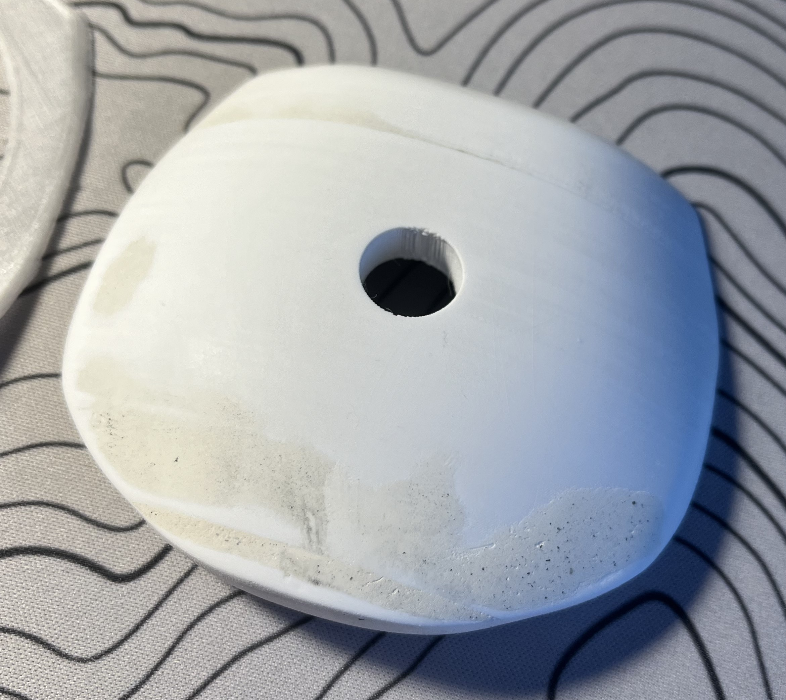
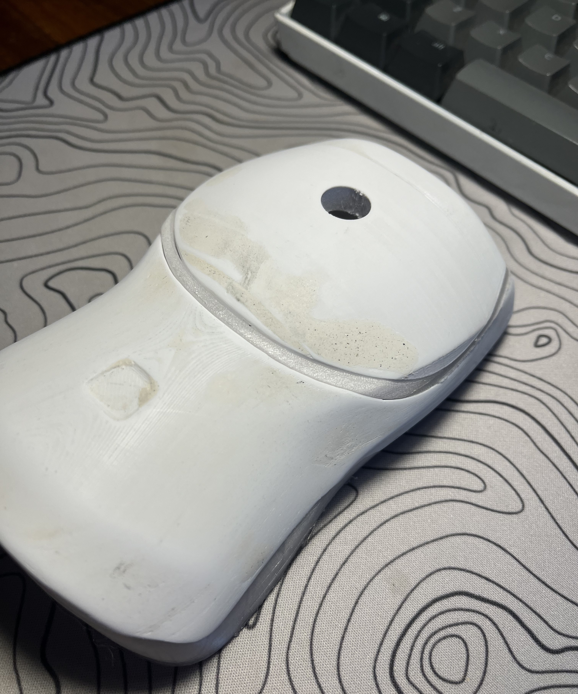
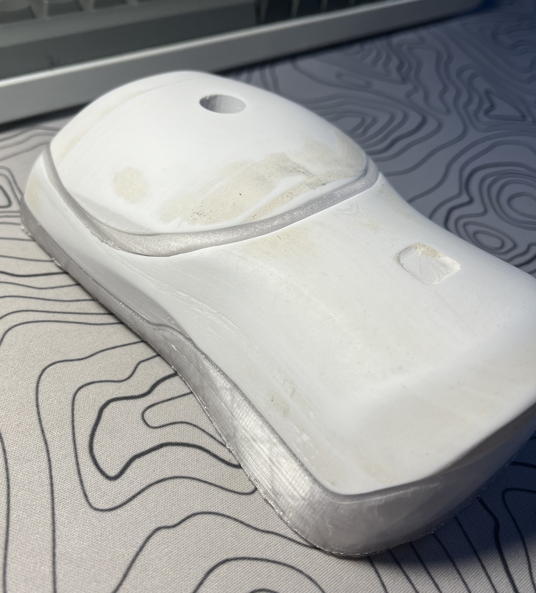

# Project Semester 5
For this module, I would like to create a project that resembles a finished product available on the market. Ever since I got started with 3d printing over the summer, my CAD skills have improved greatly. I am excited to combine my design skills with various technologies and programming methodologies I have acquired throughout my course.


In the previous semester, I created a crude home security system consisting of a single ESP32 camera, a raspberry pi with a camera running MotionEyeOS. These IP cameras were connected to a central server that I crudely constructed from an old HP laptop.

My previous system had several shortcomings:
* The video stream was extremely laggy as a result of no video compression mechanisms and limited upload bandwidth from my home ISP.
*	There were many moving parts which made it very cumbersome to set up
*	No video persistence functionality allowing the user to look back in time – the webpage only displayed a live feed.
*	No audio recording capability.
*	No enclosure for ESP32 camera -the electronics were exposed to the elements.
*	Limited person detection AI functionality -had to run as separate process in remote desktop, used very long terminal command to activate.


In this semester I would like to address these shortcomings in order to create an ecosystem of home security products similar to brands like Ring, or Ubiquiti.


I would like to utilize machine learning to count people passing the front entrance of a home. Perhaps I could create a mobile app using React Native rather than a webpage in order to display video feed and various controls.


## Update 1 -  1st iteration of doorbell camera enclosure

I spent some time in Blender working on the enclosure for the doorbell camera. I wanted to create a simple design that would be easy to print and assemble. I also wanted to make sure that the camera would be protected from the elements.

At first I thought that the ESP32 cam would be suitable for the doorbell camera, however after some consideration, I realized the the limited microprocessor of the ESP32 would not be able to handle juggling between capturing video, listening and transmitting microphone data, and handling incoming audio from the client side all at once. I decided to use a Raspberry Pi 4 with an OV5640 pi camera with night vision. This camera is capable of capturing 2k video at 30fps.

I bought some inexpensive microphone modules from AliExpress and I will be using one of those for the audio capture. For audio playback I plan to use a pair laptop speakers from a disassembled machine.

Here are some renders of the enclosure I made in Blender:





Here is an exploded view for more context on how the enclosure will be assembled:




## Update 2 -  Researching the WebRTC protocol
after looking at various options for video streaming for the Raspberry pi, I decided to use WebRTC. This is a protocol that allows for real time communication between two clients. It is used in many video conferencing applications such as Zoom, Google Meet, and Discord. It is a very robust protocol that is capable of handling video, audio, and data streams.

I am currently following this tutorial to get a basic video stream up and running:

[](https://www.youtube.com/watch?v=DvlyzDZDEq4)


## Update 3 -  1st set of prints for doorbell camera enclosure

All together, this took me about two weeks to print the parts for the first prototype as I was only able to print during the weekends.

If you look closely, you might notice the lack of joints between the parts.
I first wanted to see the parts in the real world in order to make decisions on where to place screw joints for the next iteration.
I also plan to add a magnetically attachable fixture to hold the raspberry pi.

Two of the parts were printed in PLA+ and the other two were printed in translucent PETG. I wanted the doorbell to have lighting effects to give the user visual feedback when the device is pressed and therefore the PETG piece sandwiched between the two opaque PLA pieces will diffuse light from the LEDs.



<p align="center">
  
  
</p>

I hated the look of the layer lines in my parts, which were especially visible in the rounded top piece. After some sanding starting with 100 grit and finishing with 800, I was still able to see the layer lines.

 I decided to try wood filler mixed with a small drop of PVA glue for a more spreadable consistency. I applied this mixture with a splatula, letting it dry in the sun for 10 minutes.
 After going back with 240 grit, I was really happy with how well the mixture made its way between the layer lines. I then went back with 800 grit and 1200 grit to finish the sanding process.
<p align="center">
  
  
</p>

The bottom PETG piece was printed after the smoothing process and I was really happy with the results. I will definitely be using this technique in the future.




My main goal for the next set of prints is to create screw joints and model fixtures for the raspberry pi with the camera module, laptop speakers and microphone module.

## update 4 - pain and frustration with WebRTC and camera configuration

I have been trying to get a basic video stream up and running for the past two weeks. I have been following several tutorials on youtube however after following the steps exactly, I was unsuccessful in getting a video stream to work between two browser clients to work.

I decided to put webRTC on hold for now and started testing my new OV5640 night vision camera for the raspberry pi. This process was not so straightforward as I could not make the camera or the official raspberry pi camera module to show up in interfaces when I ran raspi-config. I tried running vcgencmd get_camera to find out its not detected however when I ran lsmod I discovered that the camera sensor was showing up in the kernel.

I thought there was a defect on the pi 3 I was using so I flashed a new image of raspbian 64bit to my other pi which ran octopi with a working camera module so I thought that the pi 4 would work no problem but it didn't which proved that this was an OS issue. 

After digging through forums and Reddit threads, a number of people mentioned how they had trouble with the 64bit version of raspbian and that they had to use the 32bit version in order to get the camera to work. I flashed the 32bit version of raspbian and the camera still did not show up in interfaces. 

I was on the brink of giving up at this point however it felt as though the soultion was right in front of me. I knew that octopi was doing something which made the camera work and I noticed with the people that had the camera show up in interfaces it said **legacy** camera support. This was a lightbulb moment for me -I remembered seeing a third raspbian option in the PI imager called 32bit legacy. I flashed this image and the camera showed up in interfaces. I was able to get a simple video with FFMPEG which was a huge relief.

After this I started experimenting with sending analog audio from a MAX9814 microphone module to an arduino and have the arduino send the audio stream to the pi through the I2S protocol. This endeavor was also not so straightforward as I was unable to figure out how to interpret the data from the arduino on the Pi's side. At least I was able to get a good analog reading of the microphone data on the arduino side in serial plotter.

```

